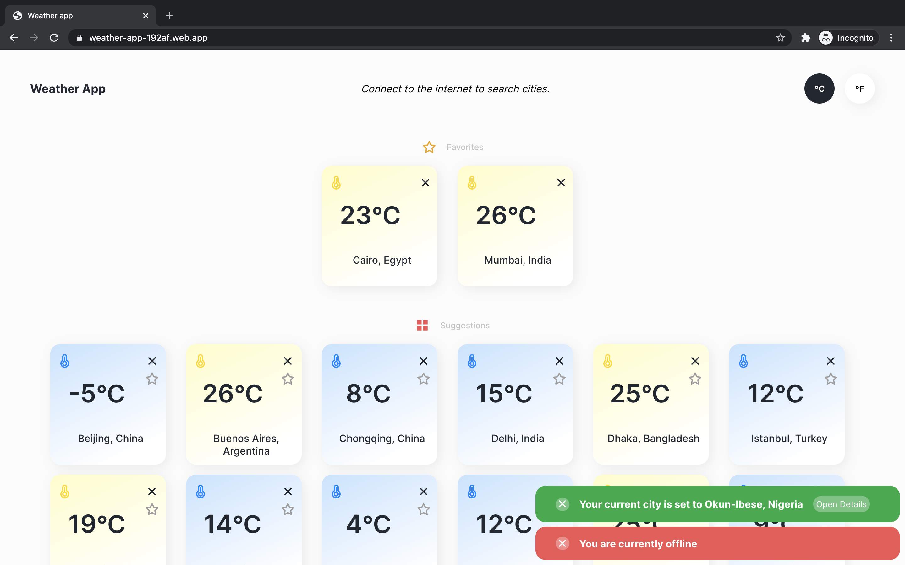

# Weather app
### Overview
A web application that fetches weather and displays weather details of cities. It allows users to look up current weather information for cities around the world and add cities to a “favorites” list.
### Features
- Uses [Weatherstack Api] to get real time weather information
- By default, users see list of the 15 largest cities in the world by population and the current temperature for each. Users can remove these entries individually from the list to clean it up.
- On start up users can grant permission to get their current location and open the details page for their city.
- Clicking on a city in the list opens a page where the user can see more weather
information.
- Users can add, remove or edit notes attached to individual cities
- Users can to use a search field to look up weather details for other cities.
- Users can add/remove cities as “favorites” which appears at the top of
the list on the home screen.
- Unit tests

### Screenshots

[Weatherstack api]: <https://weatherstack.com>